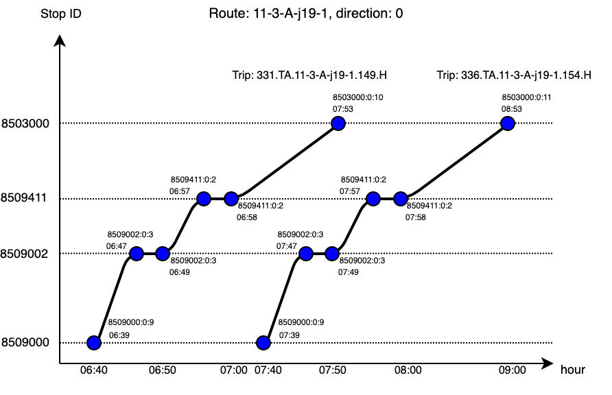

# Final Assignment: Robust Journey Planning

For this final project, we developed a robust public transport route planner using a dataset from SBB. Our route planner is designed to determine the quickest route between departure and arrival stops, considering a desired arrival time and a given confidence tolerance represented as interquartiles. For example, it can answer questions like "Which route from A to B is the fastest at least Q% of the time if I need to arrive at B before time T?" To achieve this, we implemented the found a way to modelise the delays, developed an algorithm that we named "MC-R-Choo-RAPTOR" (highly inspired from [1]), managed data using PySpark, and showcased the results using ipywidgets.

You can watch the presentation of the project [here](https://drive.google.com/file/d/17fy3raPPcxFjSbejCml8aynYOObCKbPk/view?usp=share_link)

[1]  D. Delling, T. Pajor & R.F. Werneck *Round-Based Public Transit Routing*

----
## Content

* [Code Organisation](#Code-Organisation)
* [HOW-TO](#HOW-TO)
* [Important dates](#Important-Dates)
* [Problem Motivation](#Problem-Motivation)
* [Problem Description](#Problem-Description)
* [Project Submission Checklist](#Project-Submission-Checklist)
* [Video Presentations](#Video-Presentations)
* [Grading Method](#Grading-Method)
* [Dataset Description](#Dataset-Description)

    - [Actual data](#Actual-data)
    - [Timetable data](#Timetable-data)
    - [Stations data](#Stations-data)
    - [Misc data](#Misc-data)

* [Hints](#Hints)
* [References](#References)
* [FAQ](#FAQ)

----
## Code Organisation

Code architecture:
```
.
├── Dockerfile
├── README.md
├── data                                # Contains all the data built during the preprocessing
├── environment.yml
├── figs
├── spark_processing
│   ├── Delay_modeling.ipynb            # Model the distributions of the delays
│   ├── backtesting.ipynb               # Notebook to backtest the success of a given trip  
│   ├── Network_modeling.ipynb          # Build the tables from the raw data
│   └── set_env.ipynb                   # Take the data from hdfs and save them locally             
├── post-init.sh
├── requirements.txt
├── algorithm
│   ├── choo_raptor.py                  # Implementation of the trip planner main algorithm
│   ├── load_data.py                    # Helper to create and load all the classes
│   ├── tests.py                        # Contains some tests for a few trips
│   ├── classes.py                      # Contains the definitions of all the objects used by MC-R-Choo-RAPTOR
│   └── main.ipynb                      # Main notebook, frontend of the trip planner
└── workflows
    └── my-workflow.yaml
```

Our project is a combination of multiple notebooks and python files. 

To simply use the route planner, you can directly run the notebook algorithm/main.ipynb.

In order to run the project from scratch, you will need to run the following notebooks:

Network_modeling.ipynb: This notebook take the raw data, filter the data and create all the tables needed for the main algorithm. It saves the processed tables in hdfs under /${USERNAME}/final/data/clean/.

Delay_modeling.ipynb: This notebook performes an exploratory data analysis of the data in order to infer some key insights about the delays. Then it creates a table with the parameters of the distribution of the delays for each stop under different time and transport type categories. It also saves the processed data in hdfs under /${USERNAME}/final/data/clean/.

set_env.ipynb: This notebook take the data from hdfs and save them locally.

----
## HOW-TO

In order to use our journey planner, you only need to run the notebook algorithm/main.ipynb. 

With the help of the interface, you need to enter a departure stop, an arrival stop, the latest time at which you want to arrive and a given confidence tolerance represented as interquartiles. When all the parameters are given, it will output the journey and you can also view your journey on a map. Be careful when looking for another journey as the algorithm will run every time you change one of the parameters. So, if you want to update all the parameters it might be better to rerun the last cell.

----
## Problem Motivation

Imagine you are a regular user of the public transport system, and you are checking the operator's schedule to meet your friends for a class reunion.
The choices are:

1. You could leave in 10mins, and arrive with enough time to spare for gossips before the reunion starts.

2. You could leave now on a different route and arrive just in time for the reunion.

Undoubtedly, if this is the only information available, most of us will opt for option 1.

If we now tell you that option 1 carries a fifty percent chance of missing a connection and be late for the reunion. Whereas, option 2 is almost guaranteed to take you there on time. Would you still consider option 1?

Probably not. However, most public transport applications will insist on the first option. This is because they are programmed to plan routes that offer the shortest travel times, without considering the risk factors.

----
#### Actual data

Students should already be familiar with the [istdaten](https://opentransportdata.swiss/de/dataset/istdaten).

The 2018 to 2022 data is available as a Hive table in partitioned ORC format on our HDFS system, under `/data/sbb/part_orc/istdaten`.

See assignments and exercises of earlier weeks for more information about this data, and methods to access it.

As a reminder, we provide the relevant column descriptions below.
The full description of the data is available in the opentransportdata.swiss data [istdaten cookbooks](https://opentransportdata.swiss/en/cookbook/actual-data/).

- `BETRIEBSTAG`: date of the trip
- `FAHRT_BEZEICHNER`: identifies the trip
- `BETREIBER_ABK`, `BETREIBER_NAME`: operator (name will contain the full name, e.g. Schweizerische Bundesbahnen for SBB)
- `PRODUCT_ID`: type of transport, e.g. train, bus
- `LINIEN_ID`: for trains, this is the train number
- `LINIEN_TEXT`,`VERKEHRSMITTEL_TEXT`: for trains, the service type (IC, IR, RE, etc.)
- `ZUSATZFAHRT_TF`: boolean, true if this is an additional trip (not part of the regular schedule)
- `FAELLT_AUS_TF`: boolean, true if this trip failed (cancelled or not completed)
- `HALTESTELLEN_NAME`: name of the stop
- `ANKUNFTSZEIT`: arrival time at the stop according to schedule
- `AN_PROGNOSE`: actual arrival time (see `AN_PROGNOSE_STATUS`)
- `AN_PROGNOSE_STATUS`: method used to measure `AN_PROGNOSE`, the time of arrival.
- `ABFAHRTSZEIT`: departure time at the stop according to schedule
- `AB_PROGNOSE`: actual departure time (see `AN_PROGNOSE_STATUS`)
- `AB_PROGNOSE_STATUS`: method used to measure  `AB_PROGNOSE`, the time of departure.
- `DURCHFAHRT_TF`: boolean, true if the transport does not stop there

Each line of the file represents a stop and contains arrival and departure times. When the stop is the start or end of a journey, the corresponding columns will be empty (`ANKUNFTSZEIT`/`ABFAHRTSZEIT`).
In some cases, the actual times were not measured so the `AN_PROGNOSE_STATUS`/`AB_PROGNOSE_STATUS` will be empty or set to `PROGNOSE` and `AN_PROGNOSE`/`AB_PROGNOSE` will be empty.

#### Timetable data

Timetable data are available from [timetable](https://opentransportdata.swiss/en/cookbook/gtfs/).

You will find there the timetables for the years [2018](https://opentransportdata.swiss/en/dataset/timetable-2018-gtfs), [2019](https://opentransportdata.swiss/en/dataset/timetable-2019-gtfs) and [2020](https://opentransportdata.swiss/en/dataset/timetable-2020-gtfs) and so on.
The timetables are updated weekly. It is ok to assume that the weekly changes are small, and a timetable for
a given week is thus the same for the full year - use the schedule of the most recent week for the day of the trip.

The full description of the GTFS format is available in the opentransportdata.swiss data [timetable cookbooks](https://opentransportdata.swiss/en/cookbook/gtfs/).

We provide a summary description of the files below:

* stops.txt(+):

    - `STOP_ID`: unique identifier (PK) of the stop
    - `STOP_NAME`: long name of the stop
    - `STOP_LAT`: stop latitude (WGS84)
    - `STOP_LON`: stop longitude
    - `LOCATION_TYPE`:
    - `PARENT_STATION`: if the stop is one of many collocated at a same location, such as platforms at a train station

* stop_times.txt(+):

    - `TRIP_ID`: identifier (FK) of the trip, unique for the day - e.g. _1.TA.1-100-j19-1.1.H_
    - `ARRIVAL_TIME`: scheduled (local) time of arrival at the stop (same as DEPARTURE_TIME if this is the start of the journey)
    - `DEPARTURE_TIME`: scheduled (local) time of departure at the stop 
    - `STOP_ID`: stop (station) identifier (FK), from stops.txt
    - `STOP_SEQUENCE`: sequence number of the stop on this trip id, starting at 1.
    - `PICKUP_TYPE`:
    - `DROP_OFF_TYPE`:

* trips.txt:

    - `ROUTE_ID`: identifier (FK) for the route. A route is a sequence of stops. It is time independent.
    - `SERVICE_ID`: identifier (FK) of a group of trips in the calendar, and for managing exceptions (e.g. holidays, etc).
    - `TRIP_ID`: is one instance (PK) of a vehicle journey on a given route - the same route can have many trips at regular intervals; a trip may skip some of the route stops.
    - `TRIP_HEADSIGN`: displayed to passengers, most of the time this is the (short) name of the last stop.
    - `TRIP_SHORT_NAME`: internal identifier for the trip_headsign (note TRIP_HEADSIGN and TRIP_SHORT_NAME are only unique for an agency)
    - `DIRECTION_ID`: if the route is bidirectional, this field indicates the direction of the trip on the route.
    
* calendar.txt:

    - `SERVICE_ID`: identifier (PK) of a group of trips sharing a same calendar and calendar exception pattern.
    - `MONDAY`..`SUNDAY`: 0 or 1 for each day of the week, indicating occurence of the service on that day.
    - `START_DATE`: start date when weekly service id pattern is valid
    - `END_DATE`: end date after which weekly service id pattern is no longer valid
    
* routes.txt:

    - `ROUTE_ID`: identifier for the route (PK)
    - `AGENCY_ID`: identifier of the operator (FK)
    - `ROUTE_SHORT_NAME`: the short name of the route, usually a line number
    - `ROUTE_LONG_NAME`: (empty)
    - `ROUTE_DESC`: _Bus_, _Zub_, _Tram_, etc.
    - `ROUTE_TYPE`:
    
**Note:** PK=Primary Key (unique), FK=Foreign Key (refers to a Primary Key in another table)

The other files are:

* _calendar-dates.txt_ contains exceptions to the weekly patterns expressed in _calendar.txt_.
* _agency.txt_ has the details of the operators
* _transfers.txt_ contains the transfer times between stops or platforms.

Figure 1. better illustrates the above concepts relating stops, routes, trips and stop times on a real example (route _11-3-A-j19-1_, direction _0_)


 
 
 _Figure 1._ Relation between stops, routes, trips and stop times. The vertical axis represents the stops along the route in the direction of travel.
             The horizontal axis represents the time of day on a non-linear scale. Solid lines connecting the stops correspond to trips.
             A trip is one instances of a vehicle journey on the route. Trips on same route do not need
             to mark all the stops on the route, resulting in trips having different stop lists for the same route.

<!-- #region -->
#### Stations data

For your convenience we also provide a consolidated liste of stop locations in ORC format under `/data/sbb/orc/allstops`. The schema of this table is the same as for the `stops.txt` format described earlier.

#### Misc data

Althought, not required for this final, you are of course free to use any other sources of data of your choice that might find helpful.

You may for instance download regions of openstreetmap [OSM](https://www.openstreetmap.org/#map=9/47.2839/8.1271&layers=TN),
which includes a public transport layer. If the planet OSM is too large for you,
you can find frequently updated exports of the [Swiss OSM region](https://planet.osm.ch/).

Others had some success using weather data to predict traffic delays.
If you want to give a try, web services such as [wunderground](https://www.wunderground.com/history/daily/ch/r%C3%BCmlang/LSZH/date/2022-1-1), can be a good
source of historical weather data.
